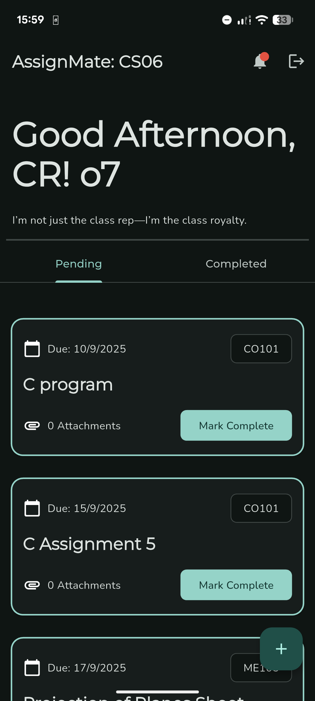
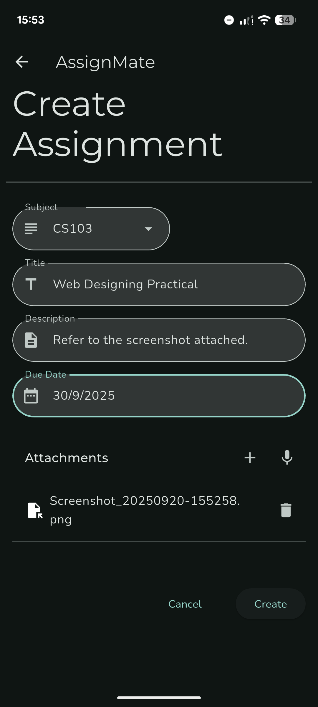
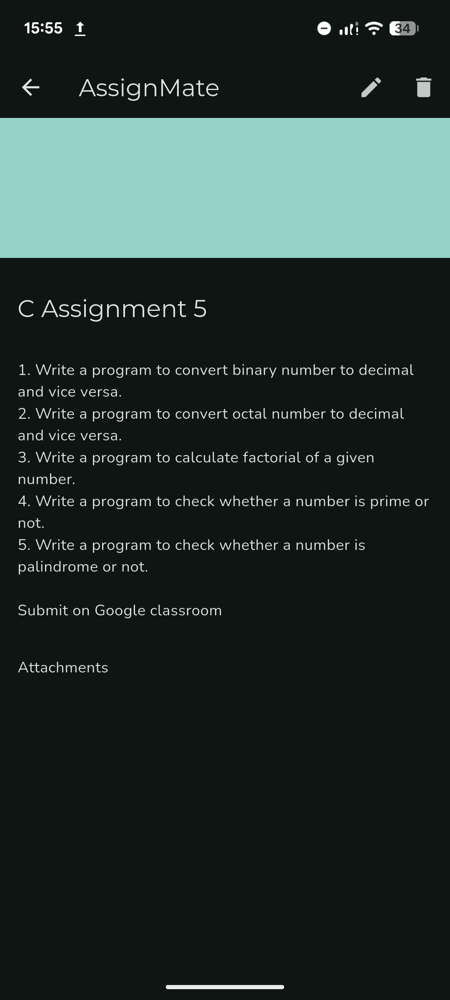
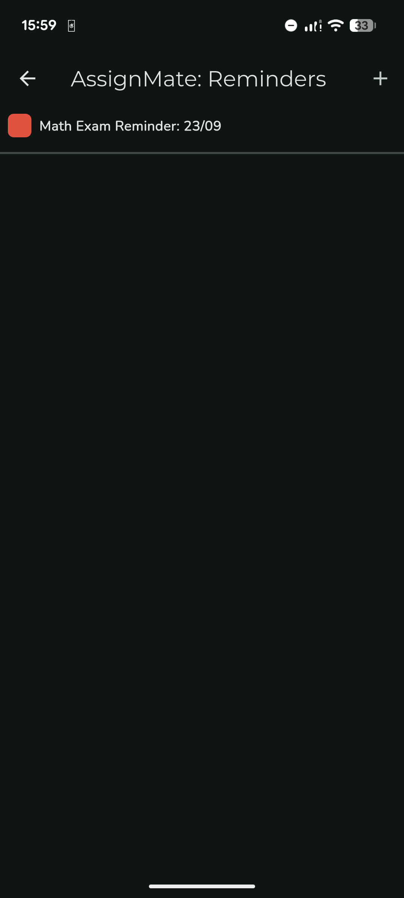

# AssignMate

Simple yet effective assignment management and centralized announcement system.
Primarily targeted towards college students, AssignMate simplifies assignment management and ensures you don't have tens of assignments waiting for you.

## Features
- View completed and pending assignments along with their respective due dates and subjects.
- Locally mark assignments as complete.
- Get reminders from the class representative whenever they make any announcement, so that it doesn't get lost in group chats.
- Assignments can have any number of attachments, synced across various drive accounts.
- Selective login: Only the class representative can login
- Caching: every app launch loads data from the local database only, which gets updated via push notifications and/or version based checkouts from the backend.

## Tech Stack
- Flutter/Dart
- Firebase for the backend (Cloud Firestore, Firebase Functions, Firebase Auth)
- Google Cloud Platform (Google Drive API, OAuth)
- BLoC Architecture with Repository Pattern
- Almost 90% shared code between mobile and desktop runners, using abstraction wherever possible.

